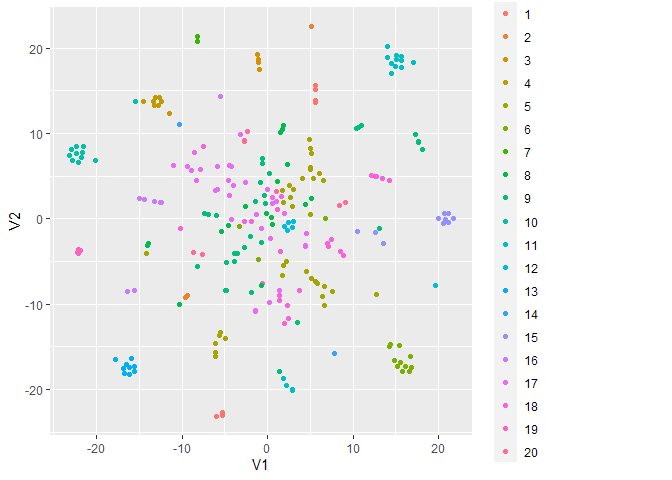

Community\_Landscaping
================
Anthony Tagliente
8/3/2020

## Community Landscaping

The project acted as a proof of concept to help identify local actors
attempt to cluster them together based on an analysis of their websites.
Hopefully this would inform work on the ground in identifying potential
partners and networks based on those findings.

## GDELT

GDELT is a great resource available for utilizing quick analysis of
large amounts of news data. In this case we are primarily interested in
looking at Organizations tagged with mentions in specific locations. I
will use Fresno, California as an example use case given its relvance at
the time to my work with the Heron Foundation.

You can read more about GDELT specifically on their website
<https://www.gdeltproject.org/>

We will specifically be using the Global Knowledge Graph data set from
google BigQuery <https://www.gdeltproject.org/data.html#googlebigquery>
in orger to build a base set of organizations and their number of
menttions.

## Google BigQuery

You will need an account with billing information attached to use google
BigQuery services. If you plan to make adjustments, I would recommend
testing them on tight date parameters to limit the amount of data you
are querying. This can and waste resources, which you may incur a cost
for at some point. There is more information on pricing etc. at
<https://cloud.google.com/bigquery/?utm_source=google&utm_medium=cpc&utm_campaign=na-US-all-en-dr-skws-all-all-trial-p-dr-1009135&utm_content=text-ad-none-any-DEV_c-CRE_288513563439-ADGP_Hybrid+%7C+AW+SEM+%7C+SKWS+%7C+US+%7C+en+%7C+PHR+~+Big+Data+~+BigQuery+~+bigquery-KWID_43700035823139005-kwd-301529154162&utm_term=KW_bigquery-ST_bigquery&gclid=Cj0KCQjw6575BRCQARIsAMp-ksNNLFJ0P1lbf6gjy_0Hvr2aGdsTm5UHPwgVeQ-HBZgaa9sgQhoPTQUaAkO2EALw_wcB#section-10>

As this is a proof of concept test, and an ongoing project, there is
still some work to be done on improving the search criteria. For now, I
have identified two ways for fresno to be tagged while trying to keep it
specifically to California. I have allso tried to exlude what I had
found to be common additional locations tags of articles creating extra
noise in the data.

This is an issue that will need to resolved, perhaps by increasing the
exlusions.

For now I am using stories from 2020, it would likely be more accurate
and inclusive with a longer time parameter.

We can query the database simply using SQL syntax

``` sql
SELECT  Locations, V2Locations, Organizations, V2Organizations, Persons, V2Persons
FROM `gdelt-bq.gdeltv2.gkg_partitioned` 
WHERE (DATE(_PARTITIONTIME) BETWEEN "2020-01-03" AND "2020-08-03") 
AND (Locations LIKE '%Fresno, CA%' OR 
     Locations LIKE '%Fresno, California%' OR 
     V2Locations LIKE '%Fresno, CA%' OR
     V2Locations LIKE '%Fresno%, California%')
AND (Locations NOT LIKE '%Los Angeles%' OR V2Locations NOT LIKE '%Los Angeles%')
AND (Locations NOT LIKE '%Sacramento%' OR V2Locations NOT LIKE '%Sacramento%')
AND (Locations NOT LIKE '%Texas%' OR V2Locations NOT LIKE '%Texas%')
AND (Locations NOT LIKE '%Arizona%' OR V2Locations NOT LIKE '%Arizona%')
AND (Locations NOT LIKE '%Oregon%' OR V2Locations NOT LIKE '%Oregon%')
AND (Locations NOT LIKE '%San Francisco%' OR V2Locations NOT LIKE '%San Francisco%')
AND (Locations NOT LIKE '%Iowa%' OR V2Locations NOT LIKE '%Iowa%')
AND (Locations NOT LIKE '%Nevada%' OR V2Locations NOT LIKE '%Nevada%')
AND (Locations NOT LIKE '%New Mexico%' OR V2Locations NOT LIKE '%New Mexico%')
LIMIT 10000
```

I saved the scv output here for this demonstration which can be read
into R:

``` r
results <- read.csv("results-20200806-140844.csv", stringsAsFactors = F)

g_dat <- as.data.frame(
              table(
                  tolower(
                      gsub(
                          pattern = ",\\d+$",
                          replacement = "",
                          x = unlist(
                                  strsplit(x=c(results$Organizations),
                                  split=";")),
                          perl = T
                      )
                  )
              )
          )

#split links into a list to be iterated on later
g_dat$links <- lapply(g_dat$Var1, FUN =function(x){results$DocumentIdentifier[which(grepl(x,results$Organizations))]})
```

This will create a data frame of organizations and the frequency which
they appear in the data set.

``` r
#head(arrange(.data = g_dat,desc(g_dat$Freq)),10)
```

I will manually run through some names that seem like they should be
excluded. My reasoning being that they are either obviously of national
interest or may be a news source rather than the topic. I tried to leave
anything ambigious in.

``` r
remove_orgs <- c('united states',
                 'facebook',
                 'cnn',
                 'twitter',
                 'associated press',
                 'instagram',
                 'white house',
                 'international monetary fund',
                 'youtube',
                 'new york times',
                 'google',
                 'reuters',
                 'washington post',
                 'olympics',
                 'linkedin')

g_dat <- g_dat[!g_dat$Var1 %in% remove_orgs, ]

# head(arrange(.data = g_dat,desc(g_dat$Freq)),10)
```

We can add a field to collect the text of the news article links. If
running this for yourself, it will take a bit of time. This process
could be improved with asynch requests which I will come back and adjust
another time.

``` r
g_dat$webtext <- NA

for (i in which(is.na(g_dat$webtext))){
  org_text <- list()
    
    for (k in 1:length(g_dat$links[[i]])){
      tryCatch({
    page <- read_html(GET(g_dat$links[[i]][k],timeout(5)))
    # or this for the text under the p nodes
    p_text<-page%>% html_nodes("p") %>% html_text()
    org_text[[k]] <- p_text
    message(k,' of ',length(g_dat$links[[i]]),' for org ',i,' of ',nrow(g_dat),' ',paste(as.character(g_dat$Var1[i])))
    #Sys.sleep(1)
    closeAllConnections()
  },error = function(e){})
    }
g_dat$webtext[i] <- paste0(unlist(org_text),collapse =" ")  
}
# add rownames which are used as Doc IDs for corpus
rownames(g_dat) <- g_dat$Var1

#Saving dataframe as backup and to have as an easily usable example for this markdown
write.csv(g_dat[,-3],"web_text.csv")
```

``` r
# Read in if you are running this interactivly.
g_dat_in <- read.csv("web_text.csv", row.names = "X")
```

Now that we have a table containing the org names as well as the text of
the news articles linked in the gdelt database. We can begin to
construct a corpus, which is a useful object for doing text analysis.

In this case I will be using the `quanteda` package and the `tm`
package.

``` r
web_corp <- corpus(g_dat_in[,c("Freq","webtext")], text_field = "webtext")

my_corp <- Corpus(VectorSource(web_corp))
my_corp <- tm_map(my_corp,content_transformer(tolower))
my_corp <- tm_map(my_corp,removePunctuation)
my_corp <- tm_map(my_corp,removeNumbers)
my_corp <- tm_map(my_corp,stripWhitespace)
my_corp <- tm_map(my_corp,stemDocument)
my_corp <- tm_map(my_corp,removeWords,stopwords('en'))
my_corp <- corpus(my_corp)

dtm <- dfm(my_corp)


# filter terms that occur in less than 5% of org news and more than 90% of org news to try and elminiate random sparse ness and or
# irrelevant words to understanding similarity. Somewhat arbitrary choice
web_dtm_filt  <- dfm_trim(dtm,
                              min_docfreq = 0.05,
                              max_docfreq = 0.9,
                              docfreq_type = "prop"
)
web_dtm_filt
```

    ## Document-feature matrix of: 269 documents, 5,508 features (79.1% sparse).
    ##                                         features
    ## docs                                     women radio network internet peopl dan
    ##   afghan women association international   429   162      70       23    78   3
    ##   albertsons                                 0     0       0        0    45   0
    ##   alcan                                      1     0       2        0    33   0
    ##   america open technology institute          0     0       0       14    43   0
    ##   american civil liberties union            22     1       2        0    46   0
    ##   american community survey                  0     0       0        0    33   0
    ##                                         features
    ## docs                                     hill presid logic inc
    ##   afghan women association international    1     25     1   3
    ##   albertsons                                9      0     0   0
    ##   alcan                                     0      2     1   1
    ##   america open technology institute        14     43     0   0
    ##   american civil liberties union            1      4     0   0
    ##   american community survey                 0      2     0   0
    ## [ reached max_ndoc ... 263 more documents, reached max_nfeat ... 5,498 more features ]

We now have a Document Feature Matrix, which is similar to a Document
Term Matrix adjusted to work with other quanteda functions. Since the
goal here is to have an easily interpretible chart, it would be nice to
understand what words are being associated with what orgs, partiularly
to check that the cluistering makes sense.

Since we don’t already know what any topics should be we can use an un
supervised approach to topic modeling using the LDA function from the
`textmodels` package.

``` r
# We can add a layer of topic modeling to give us a better insight into similar org news texts and common words associated with their grouping.

# Create a topic model object from the corpus
dtm_topics <- convert(web_dtm_filt, to = "topicmodels")

# and use the LDA function to determine 20 topic clusters, the number can be better optimized. This will take a bit of time to finish running.
lda <- topicmodels::LDA(dtm_topics, k = 20)

get_terms(lda,5)
```

    ##      Topic 1     Topic 2    Topic 3     Topic 4   Topic 5   Topic 6      
    ## [1,] "household" "food"     "fish"      "fbi"     "polic"   "energi"     
    ## [2,] "share"     "american" "river"     "tech"    "offic"   "project"    
    ## [3,] "median"    "today"    "water"     "appl"    "counti"  "develop"    
    ## [4,] "citi"      "whether"  "fli"       "iphon"   "report"  "environment"
    ## [5,] "photo"     "america"  "reservoir" "compani" "sheriff" "clean"      
    ##      Topic 7 Topic 8  Topic 9  Topic 10  Topic 11  Topic 12 Topic 13
    ## [1,] "low"   "fire"   "counti" "student" "drug"    "prison" "women" 
    ## [2,] "high"  "counti" "case"   "colleg"  "generic" "inmat"  "radio" 
    ## [3,] "mph"   "nation" "health" "univers" "health"  "viral"  "also"  
    ## [4,] "wind"  "offic"  "covid"  "may"     "price"   "featur" "lynch" 
    ## [5,] "feet"  "two"    "public" "aid"     "compani" "via"    "creat" 
    ##      Topic 14    Topic 15 Topic 16  Topic 17  Topic 18 Topic 19  Topic 20
    ## [1,] "tree"      "mask"   "fight"   "year"    "court"  "mani"    "newsom"
    ## [2,] "say"       "health" "zoom"    "school"  "case"   "year"    "gavin" 
    ## [3,] "chill"     "wear"   "white"   "work"    "feder"  "yearold" "gov"   
    ## [4,] "pistachio" "public" "event"   "peopl"   "law"    "plan"    "covid" 
    ## [5,] "winter"    "face"   "compani" "student" "use"    "now"     "food"

We also want to significantly reduce the number of dimensions in order
to better explain the data. t.sne is very good at reducing and high
numbers of dimensions for the purpose of visualizations.

``` r
dat_tsne <- tsne(dtm_topics)
```

    ## Warning in if (class(X) == "dist") {: the condition has length > 1 and only the
    ## first element will be used

    ## sigma summary: Min. : 0.240969594214663 |1st Qu. : 0.45820397339818 |Median : 0.72637107940506 |Mean : 0.771875900737361 |3rd Qu. : 1.1151539880689 |Max. : 1.45051369086749 |

    ## Epoch: Iteration #100 error is: 15.118095005869

    ## Epoch: Iteration #200 error is: 0.415095401752213

    ## Epoch: Iteration #300 error is: 0.373262251199922

    ## Epoch: Iteration #400 error is: 0.33606705868988

    ## Epoch: Iteration #500 error is: 0.335552052885724

    ## Epoch: Iteration #600 error is: 0.335441817158021

    ## Epoch: Iteration #700 error is: 0.335425096781154

    ## Epoch: Iteration #800 error is: 0.335247605493356

    ## Epoch: Iteration #900 error is: 0.335091028089243

    ## Epoch: Iteration #1000 error is: 0.335082180851604

# Making the Final Plot.

``` r
topic_words <- sapply(get_topics(lda),FUN =  function(x){paste(get_terms(lda,5)[,x], collapse = ", ")})

p <- ggplot(as.data.frame(dat_tsne), aes(x = V1, y = V2,label = rownames(dtm_topics),text=topic_words,color=as.factor(get_topics(lda)))) + 
  geom_point()
# using ggplotly we can plot an interactive html version. However this is not supported for RMarkdown on github.
# pp <- ggplotly(p)

p
```

<!-- -->
